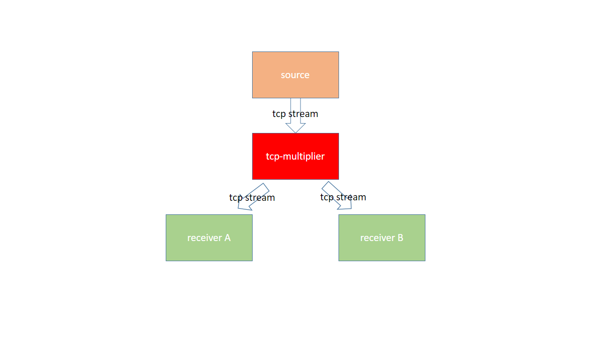

# net-multiplier
a simple tcp/udp multiplier written by golang .It duplicates a single tcp/udp input into multi outputs at the same time. 

### Theory


### Usage

``````
tcp-multiplier -destTcpSvrAddrs 192.168.1.6:9060,192.168.1.60:9060 --localTcpClientHost 0.0.0.0 --localTcpSvrAddr 0.0.0.0:9070

  -destTcpSvrAddrs
        the destinations that the data is relayed to,it is a comma-delimited string
  -localTcpClientHost
        designate the host to which the sender is bind to 
  -localTcpSvrAddr
        the address where the server listens
``````